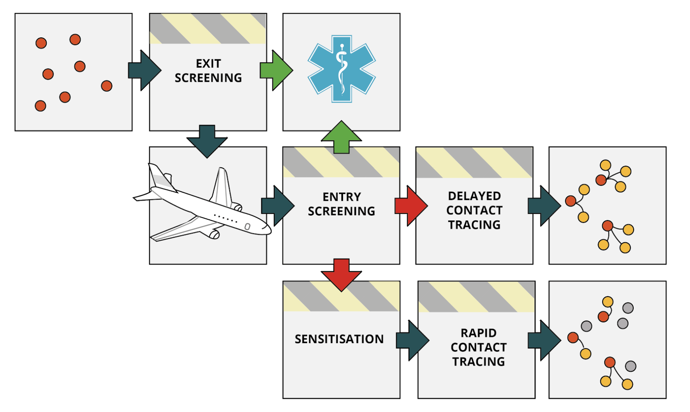

## Key assumptions

Each of the two models considered here have important assumptions that should be considered when interpreting results.

### Airport screening

* Would-be travellers will not travel if hospitalised
* Screening at exit and entry are independent processes
* Probability of detection by screening does not depend on intensity of symptoms
* Estimated proportions are averages. Substantial variation in proportions are expected if only a small number of travellers are considered
* Travellers will self-report only when they become severely symptomatic during their travel
* Travellers may become severely symptomatic either from a latent state (having boarded the plane with a latent infection) or from a symptomatic state (having gone undetected by the exit screening)
* Travellers developing severe symptoms during their travel will be hospitalised without entry screening
* Asypmtomatically infected travellers remain asymptomatic throughout their entire infection
* All symptomatic travellers will eventually be reported

### Delaying an outbreak

* Infected travellers arrive at a constant rate which does not change over time
* Traveller sensitisation reduces the reproduction number, *R*0, by the given effectiveness
* The threshold number of infected travellers required to generate an outbreak depends on the reproduction number
* Traveller screening reduces the number of infected arrivals that would enter the country by diverting them to a hospital
* The delay time is the additional time it would take to reach the outbreak threshold in the presence of interventions
* An infinitely long delay means no outbreak occurs in the model
* The *R*0 is Gamma distributed and its parameters are determined from its 95% interval
* The dispersion parameter, *k*, describes the individual variation in *R*0
* All infected travellers have spent the same time travelling but may be at different points in their infection
